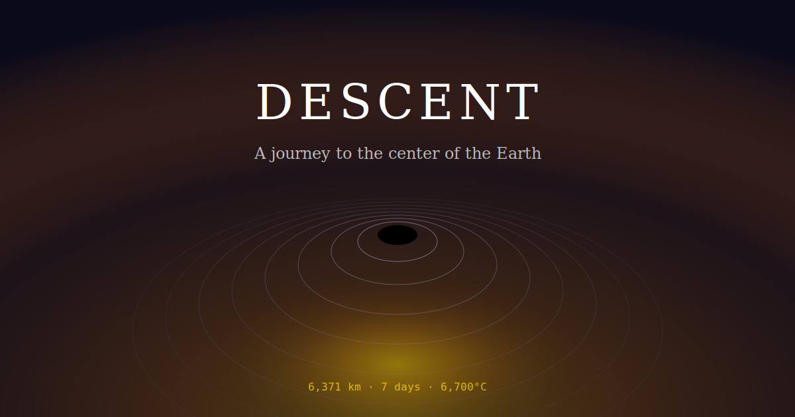

# Descent

**A 3.5-minute journey to the center of the Earth.**

What happens if you jump into a tunnel that goes straight through the planet? Spoiler: you die at 1.1 km from heat stroke. But your dust keeps falling...

[**Try it live →**](https://metachris.github.io/descent/)



## Features

- **Poetic narrative** — Second-person, present tense. You're not learning physics, you're *experiencing* it.
- **Procedural audio** — Warm pads, harmonic drones, shimmer, percussion — all synthesized in real-time with stereo panning. No audio files.
- **Tunnel visuals** — Canvas-rendered concentric rings, radial particles, and phase-blended gradients that evolve as you fall.
- **6 languages** — English, German, Spanish, Chinese, Japanese, Polish — poetic adaptations, not literal translations. ([See translations](src/data/locales/))
- **Voice narration** — Web Speech API with style-aware pitch, rate, and volume per narrative mood.
- **3.5 minutes** — Short enough to share, long enough to feel something.

## Quick Start

```bash
npm install
npm run dev
```

Open [http://localhost:3000/descent/](http://localhost:3000/descent/), put on headphones, and fall.

## Controls

| Key | Action |
|-----|--------|
| Space | Play/Pause |
| ← → | Skip 5 seconds |
| R | Restart |
| F | Fullscreen |

## The Science

Based on real physics from [Dr. Christopher S. Baird](https://www.wtamu.edu/~cbaird/sq/2013/10/04/what-would-happen-if-you-fell-into-a-hole-that-went-through-the-center-of-the-earth/):

- With air resistance: ~7 days to reach the center
- Terminal velocity: ~200 km/h
- You'd die at 1.1 km (47°C heat stroke)
- Without air: 38 minutes 11 seconds, reaching 28,800 km/h

## Tech Stack

| What | How |
|------|-----|
| UI | React 18 + TypeScript + Tailwind |
| Build | Vite |
| State | Zustand |
| Audio | Web Audio API (procedural synthesis + stereo panning) |
| Voice | Web Speech API |
| Visuals | Canvas 2D (tunnel, particles), CSS gradients |
| Deploy | GitHub Pages + Actions |

## Fork & Remix

1. Fork and clone
2. `npm install && npm run dev`
3. The [`CLAUDE.md`](CLAUDE.md) file has full project context — hand it to any AI assistant or read it yourself
4. Push to your fork — GitHub Actions auto-deploys to GitHub Pages (enable Pages with Source: GitHub Actions in repo settings)

Ideas to try:
- *"Add a French translation"*
- *"Make the visuals more psychedelic"*
- *"Add a heartbeat sound that speeds up as you approach the core"*
- *"Change the ending to be more ominous"*
- *"Add a moon version — what if you fell through the Moon instead?"*
- *"Make the particles react to the audio"*
- *"Add a depth counter that ticks up like an odometer"*

## Personal Note

I've been fascinated by this thought experiment since I read [this article by Prof. Baird](https://www.wtamu.edu/~cbaird/sq/2013/10/04/what-would-happen-if-you-fell-into-a-hole-that-went-through-the-center-of-the-earth/) several years ago.

I built this with [Claude Code](https://claude.ai/code) over about ten hours — Claude handled the implementation while I focused on creative direction and feedback. It was a blast. I wouldn't have had the time to learn all the APIs and build this from scratch alongside family and work. It would have taken weeks and simply never happened. This felt like a genuine unlock of creative potential.

## Credits

Created by [Chris Hager](https://www.metachris.dev) with [Claude Code](https://claude.ai/code).

All code and content released under the MIT License.

---

*6,371 km. One week. Six languages. One journey.*
